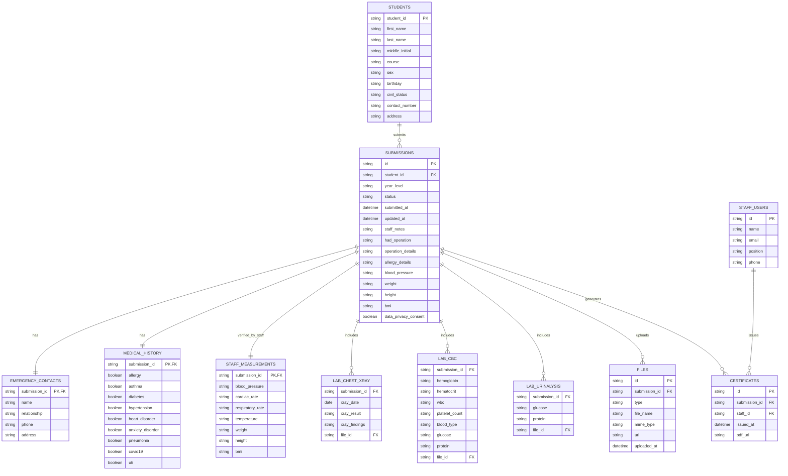

# Gordon College Health Services – ERD (Inferred)

PDF diagram: `ERD.pdf`

This ERD is inferred from the current UI and mock data. It reflects the fields used in:

- `src/app/lib/mock-data.ts`
- `src/app/pages/student/medical-form.tsx`
- `src/app/pages/staff/record-review.tsx`
- `src/app/pages/staff/certificates.tsx`
- `src/app/pages/staff/submissions.tsx`

## Diagram (Mermaid)

## Table/Column Summary

### STUDENTS
- `student_id` (PK)
- `first_name`
- `last_name`
- `middle_initial`
- `course`
- `sex`
- `birthday`
- `civil_status`
- `contact_number`
- `address`

### SUBMISSIONS
- `id` (PK)
- `student_id` (FK → STUDENTS.student_id)
- `year_level`
- `status`
- `submitted_at`
- `updated_at`
- `staff_notes`
- `had_operation`
- `operation_details`
- `allergy_details`
- `blood_pressure`
- `weight`
- `height`
- `bmi`
- `data_privacy_consent`

### EMERGENCY_CONTACTS
- `submission_id` (PK/FK → SUBMISSIONS.id)
- `name`
- `relationship`
- `phone`
- `address`

### MEDICAL_HISTORY
- `submission_id` (PK/FK → SUBMISSIONS.id)
- `allergy`
- `asthma`
- `diabetes`
- `hypertension`
- `heart_disorder`
- `anxiety_disorder`
- `pneumonia`
- `covid19`
- `uti`

### STAFF_MEASUREMENTS
- `submission_id` (PK/FK → SUBMISSIONS.id)
- `blood_pressure`
- `cardiac_rate`
- `respiratory_rate`
- `temperature`
- `weight`
- `height`
- `bmi`

### LAB_CHEST_XRAY
- `submission_id` (FK → SUBMISSIONS.id)
- `xray_date`
- `xray_result`
- `xray_findings`
- `file_id` (FK → FILES.id)

### LAB_CBC
- `submission_id` (FK → SUBMISSIONS.id)
- `hemoglobin`
- `hematocrit`
- `wbc`
- `platelet_count`
- `blood_type`
- `glucose`
- `protein`
- `file_id` (FK → FILES.id)

### LAB_URINALYSIS
- `submission_id` (FK → SUBMISSIONS.id)
- `glucose`
- `protein`
- `file_id` (FK → FILES.id)

### FILES
- `id` (PK)
- `submission_id` (FK → SUBMISSIONS.id)
- `type` (`signature|xray|cbc|urinalysis`)
- `file_name`
- `mime_type`
- `url`
- `uploaded_at`

### CERTIFICATES
- `id` (PK)
- `submission_id` (FK → SUBMISSIONS.id)
- `staff_id` (FK → STAFF_USERS.id)
- `issued_at`
- `pdf_url`

### STAFF_USERS
- `id` (PK)
- `name`
- `email`
- `position`
- `phone`
