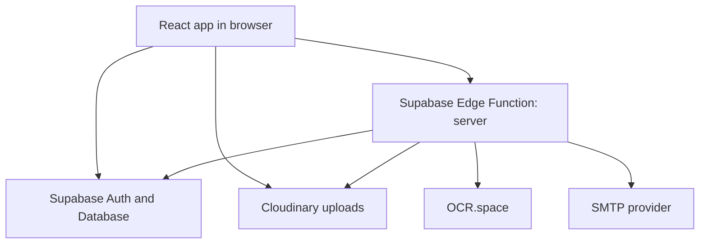

# ClinicKa

ClinicKa is a role-based web application for managing student medical requirements at Gordon College.

In simple terms:

- Students submit their clinic requirements online.
- Clinic staff review records, update statuses, and issue clearances.
- Admins manage users, announcements, reports, and system settings.
- Super admins manage administrator accounts.

This project uses a React frontend, Supabase for authentication and data, and Cloudinary for uploaded media.

## What The App Does

ClinicKa is built around the yearly medical clearance workflow.

### Student portal

Students can:

- sign in using their school account
- complete their profile
- choose an academic year
- fill out the medical form and privacy waiver
- upload lab files such as chest x-ray, CBC, and urinalysis
- track review progress
- view clearance and certificate-related pages

### Staff portal

Clinic staff can:

- view incoming submissions
- open a student record for review
- check uploaded files
- update submission statuses
- view reports and records
- manage announcements
- configure staff-facing settings

### Admin portal

Admins can:

- manage user accounts
- manage announcements
- view reports
- update system settings

### Super admin portal

Super admins can:

- manage administrator accounts

## Submission Status Flow

A submission usually moves through this lifecycle:

`pending` -> `in_review` -> `returned` / `physical_exam_done` -> `approved`

If a returned submission is fixed and uploaded again, it becomes `resubmitted`.

## How It Works

ClinicKa has three main pieces:

1. **React frontend**
   This is the browser app in `src/`. It handles the user interface, routing, forms, and role-based portals.

2. **Supabase backend**
   Supabase provides authentication, database tables, storage metadata, and the deployed Edge Function used for server-only work.

3. **Cloudinary media storage**
   Uploaded images and files are stored in Cloudinary, while Supabase stores the app data and file references.

Some actions cannot safely happen in the browser, such as:

- using admin-level Supabase access
- sending SMTP emails
- calling OCR.space
- validating or completing secure uploads

Those are handled by the Supabase Edge Function named `server`.

## Architecture At A Glance



## Quick Start

### Requirements

- Node.js 20 or newer
- npm 10 or newer
- a working Supabase project for ClinicKa

### 1. Install dependencies

```bash
npm install
```

### 2. Create a local environment file

PowerShell:

```powershell
Copy-Item .env.example .env.local
```

### 3. Add the minimum frontend variables

At minimum, set these in `.env.local`:

```env
VITE_SUPABASE_URL=https://your-project.supabase.co
VITE_SUPABASE_ANON_KEY=your-anon-key
```

You can also use `VITE_SUPABASE_PUBLISHABLE_KEY` instead of `VITE_SUPABASE_ANON_KEY`.

### 4. Start the app

```bash
npm run dev
```

Open `http://localhost:5173`.

## Environment Variables

See [.env.example](.env.example) for the full list.

### Frontend variables

Required for local development:

- `VITE_SUPABASE_URL`
- `VITE_SUPABASE_ANON_KEY` or `VITE_SUPABASE_PUBLISHABLE_KEY`

Commonly used:

- `VITE_SUPABASE_PROJECT_ID`
- `VITE_SITE_URL`
- `VITE_CLOUDINARY_CLOUD_NAME`

### Edge Function variables

Required when deploying the `server` function:

- `SUPABASE_URL`
- `SUPABASE_SERVICE_ROLE_KEY`
- `SITE_URL` or `ALLOWED_ORIGINS`

Optional but commonly used:

- `ALLOW_VERCEL_PREVIEW_ORIGINS`
- `SIGNED_STORAGE_URL_EXPIRES_SECONDS`
- `ENABLE_REQUEST_LOGGING`

### Email variables

Used for status notification emails:

- `SMTP_HOST`
- `SMTP_PORT`
- `SMTP_USER`
- `SMTP_PASS`
- `SMTP_FROM_EMAIL`
- `SMTP_FROM_NAME`

### OCR variables

Used for lab-file text extraction:

- `OCR_SPACE_API_KEY` or `OCRSPACE_API_KEY`

### Cloudinary variables

Used for uploads and asset delivery:

- `CLOUDINARY_CLOUD_NAME`
- `CLOUDINARY_API_KEY`
- `CLOUDINARY_API_SECRET`
- `CLOUDINARY_BASE_FOLDER`
- `VITE_CLOUDINARY_CLOUD_NAME`

### Important safety rule

Never expose `SUPABASE_SERVICE_ROLE_KEY` or `CLOUDINARY_API_SECRET` to the browser. They must stay server-side only.

## Project Structure

### Main folders

- `src/` - frontend application
- `src/app/pages/` - page modules for student, staff, admin, and super admin portals
- `src/app/lib/` - auth, API calls, and shared frontend logic
- `src/app/components/` - reusable UI and feature components
- `supabase/functions/server/` - the main Edge Function backend
- `supabase/migrations/` - included Supabase migration files
- `scripts/` - developer utility scripts
- `public/` - static assets

### Good starting points

If you are new to the codebase, start here:

- [src/main.tsx](src/main.tsx) - app entry point and PWA bootstrapping
- [src/app/App.tsx](src/app/App.tsx) - root app providers
- [src/app/routes.tsx](src/app/routes.tsx) - all app routes
- [src/app/lib/auth.tsx](src/app/lib/auth.tsx) - auth flow and route protection
- [src/app/lib/api.ts](src/app/lib/api.ts) - frontend API layer
- [supabase/functions/server/index.ts](supabase/functions/server/index.ts) - server function routes and handlers

## Common Flows

### Login and role routing

1. The user signs in through Supabase Auth.
2. The app loads the user profile and role.
3. The user is redirected to the correct portal.

### Student submission flow

1. The student completes profile and form details.
2. The student uploads required files.
3. The record is saved and becomes available for staff review.

### Staff review flow

1. Staff open the submissions queue.
2. Staff inspect the medical form and uploaded files.
3. Staff update the submission status.
4. Optional email notifications can be sent.

### OCR-assisted review

OCR can be used to extract values from supported lab uploads. It is optional and mainly helps staff encode results faster.

## Available Scripts

- `npm run dev` - start the Vite development server
- `npm run typecheck` - run TypeScript checks
- `npm run verify:ocr` - verify OCR parsing behavior
- `npm run build` - create the production build in `dist/`
- `npm run check` - run typecheck, OCR verification, and production build

## Build And Deploy

### Frontend

Build the SPA:

```bash
npm run build
```

Deployment helpers included in this repo:

- [vercel.json](vercel.json) - Vercel rewrites and security headers
- [Dockerfile](Dockerfile) - container build for the frontend
- [nginx.conf](nginx.conf) - Nginx config for SPA hosting

### Supabase Edge Function

Deploy the backend function:

```bash
supabase functions deploy server
```

Make sure your function secrets and CORS settings are configured before deployment.

## Database And Storage Notes

This repository includes Supabase migration files in `supabase/migrations/`, but you should not assume it is a complete one-command bootstrap for a brand new project.

Before running the app against a fresh Supabase instance, verify that you have:

- all required tables
- all required RLS policies
- all required storage buckets
- any expected seed or settings data

Buckets used by the app commonly include:

- `profile`
- `student_signature`
- `lab_chest_xray`
- `lab_cbc`
- `lab_urinalysis`

There are also legacy references to `medical-files` for compatibility.

## Troubleshooting

- `Missing Supabase config...`
  Check `VITE_SUPABASE_URL` and `VITE_SUPABASE_ANON_KEY`.

- Uploads fail
  Verify Cloudinary config, Supabase storage metadata, and expected buckets or policies.

- Google sign-in is blocked
  The app restricts access to `@gordoncollege.edu.ph` accounts.

- Status emails are not sending
  Verify SMTP secrets in the deployed Edge Function environment.

- OCR is not working
  Check that the OCR API key is set and the uploaded file type is supported.

## Tech Stack

- React 18
- TypeScript
- React Router 7
- Vite 6
- Tailwind CSS 4
- TanStack Query
- Supabase Auth, Postgres, Storage, and Edge Functions
- Cloudinary
- PWA support through `vite-plugin-pwa` and Workbox

## License And Usage

This repository does not currently declare a standard open-source license file.

Unless your organization has a separate written agreement, treat this project as source-available reference material rather than unrestricted open-source software.

## Disclaimer

ClinicKa is intended to support clinic workflow, student medical record intake, and administrative coordination.

It is not a substitute for professional medical judgment, diagnosis, treatment, or emergency response. Deploying institutions are responsible for validating data accuracy, access controls, privacy practices, and legal compliance.
