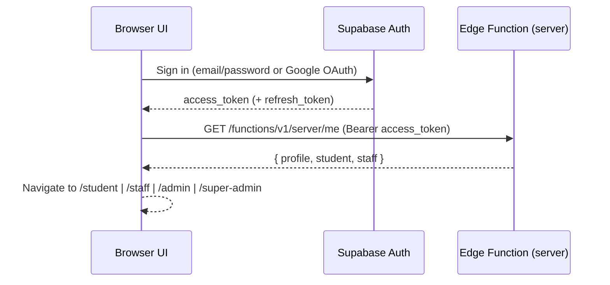
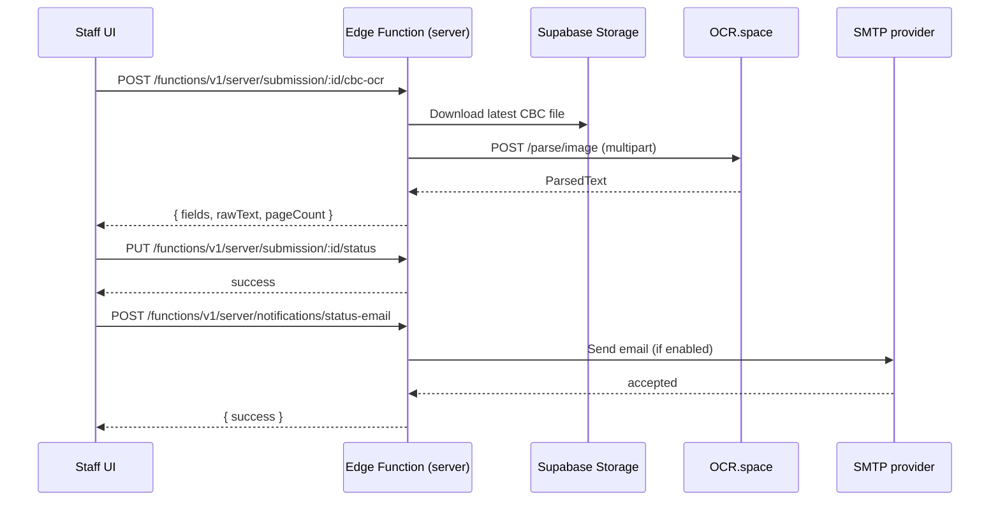

# ClinicKa

ClinicKa is a web-based clinic management system for Gordon College.

It helps students submit medical requirements, lets clinic staff review and clear records, and provides admin tooling for user accounts, settings, and reporting. The application is a React + Vite single-page app connected to Supabase (Auth, Postgres, Storage, and Edge Functions).

## Contents

- [Product Overview](#product-overview)
- [Architecture At A Glance](#architecture-at-a-glance)
- [Repo Tour (Where To Start Reading Code)](#repo-tour-where-to-start-reading-code)
- [Frontend Architecture](#frontend-architecture)
- [Backend Architecture](#backend-architecture)
- [Supabase Data Model (High-Level)](#supabase-data-model-high-level)
- [Key Runtime Flows](#key-runtime-flows)
- [Edge Function API (`server`)](#edge-function-api-server)
- [OCR Pipeline](#ocr-pipeline)
- [Tech Stack](#tech-stack)
- [Prerequisites](#prerequisites)
- [Quick Start](#quick-start)
- [Configuration](#configuration)
- [Useful Scripts](#useful-scripts)
- [Project Structure](#project-structure)
- [Build And Deploy](#build-and-deploy)
- [Troubleshooting](#troubleshooting)
- [Copyright Notice](#copyright-notice)
- [Disclaimer](#disclaimer)
- [License](#license)
- [Third-Party Licenses](#third-party-licenses)

## Product Overview

ClinicKa has four role-based portals:

- Student portal (`/student`): profile management, yearly medical submission, requirements tracking, announcements, and certificate/clearance viewing.
- Staff portal (`/staff`): submission queue, detailed record review, OCR-assisted extraction for lab results, and record status updates.
- Admin portal (`/admin`): user account management, staff management, system settings, reports, and announcements.
- Super admin portal (`/super-admin`): manage administrator accounts.

### Submission Status Lifecycle

The core workflow revolves around a submission whose status is one of:

`pending` → `in_review` → `returned`/`physical_exam_done` → `approved` (with `resubmitted` used when a student re-uploads after a return).

This lifecycle is surfaced throughout the staff queue and student dashboards (see `SubmissionStatus` in [src/app/lib/record-types.ts](src/app/lib/record-types.ts)).

## Architecture At A Glance

```mermaid
graph TD
  UI[React + Vite SPA] -->|Auth / REST / Storage| SB[(Supabase)]
  UI -->|Privileged ops| FX[Edge Function: server (Hono)]
  FX -->|Service role key| SB
  FX -->|SMTP| SMTP[SMTP provider]
  FX -->|OCR| OCR[OCR.space API]
```

Key idea:

- The browser can directly talk to Supabase Auth, PostgREST (`/rest/v1/*`), and Storage using the anonymous key + user bearer tokens.
- Privileged operations (admin actions, server-side joins/mapping, OCR calls, some signed URL generation) go through the Supabase Edge Function named `server`.

## Repo Tour (Where To Start Reading Code)

If you are new to the repo, these files show the application’s “spine”:

- App bootstrap + PWA behavior: [src/main.tsx](src/main.tsx)
- Global providers (React Query, Auth, Router, Toaster): [src/app/App.tsx](src/app/App.tsx)
- Route map + role gating: [src/app/routes.tsx](src/app/routes.tsx)
- Lazy loaded page modules + route prefetching: [src/app/route-modules.ts](src/app/route-modules.ts)
- Auth state machine (session, role, password recovery/setup, idle timeout): [src/app/lib/auth.tsx](src/app/lib/auth.tsx)
- All Supabase + edge-function calls live here: [src/app/lib/api.ts](src/app/lib/api.ts)

Backend edge function entrypoint:

- Hono router and route handlers: [supabase/functions/server/index.ts](supabase/functions/server/index.ts)
- Edge function runtime config + CORS allowlist + server-side Supabase client: [supabase/functions/server/context.ts](supabase/functions/server/context.ts)
- Requester authentication + archived-account checks + super-admin overrides: [supabase/functions/server/requester.ts](supabase/functions/server/requester.ts)
- Submission mapping, staff queues, analytics + in-memory caches: [supabase/functions/server/submissions.ts](supabase/functions/server/submissions.ts)
- Email notification sender: [supabase/functions/server/notifications.ts](supabase/functions/server/notifications.ts)
- OCR parsing + OCR.space client: [supabase/functions/server/ocr-space-ocr.ts](supabase/functions/server/ocr-space-ocr.ts)

## Frontend Architecture

### Routing + Code Splitting

- Routes are declared in [src/app/routes.tsx](src/app/routes.tsx) using `createBrowserRouter`.
- Each portal (`/student`, `/staff`, `/admin`, `/super-admin`) uses a layout route with nested children.
- Route components are lazily imported via [src/app/route-modules.ts](src/app/route-modules.ts), and rendered with `Suspense` skeletons.
- Each portal layout prefetches its route modules after mount via `prefetchPortalRoutes()` (see [src/app/route-modules.ts](src/app/route-modules.ts) and the portal layout pages under [src/app/pages](src/app/pages)).

### Auth + Session

- `AuthProvider` lives in [src/app/lib/auth.tsx](src/app/lib/auth.tsx) and is mounted globally in [src/app/App.tsx](src/app/App.tsx).
- Sessions are stored in `sessionStorage` as `gc_supabase_session` (see [src/app/lib/api.ts](src/app/lib/api.ts)). This is a deliberate security tradeoff: sessions do not persist after closing the browser.
- The router gates portal routes through `RequireAuth` (role allowlist) and `RedirectIfAuthenticated` (prevent signed-in users from seeing auth/marketing pages).
- Staff/admin/super-admin sessions also enforce an idle timeout driven by server settings.

### Data Access Pattern

All client-side Supabase access is centralized in [src/app/lib/api.ts](src/app/lib/api.ts):

- `authRequest()` calls Supabase Auth endpoints (`/auth/v1/*`).
- `restRequest()` calls Supabase PostgREST (`/rest/v1/*`).
- `apiRequest()` calls Supabase Edge Functions (`/functions/v1/*`).

The API layer also:

- Refreshes access tokens automatically on `401` (using the refresh token when available).
- Uses “try edge function first, then fallback to PostgREST” for some operations so older deployments can still function when specific routes are missing.

For caching and request deduplication, the app uses TanStack Query with a shared client in [src/app/query-client.ts](src/app/query-client.ts). The login experience is warmed with best-effort query + route prefetching in [src/app/lib/login-prefetch.ts](src/app/lib/login-prefetch.ts).

### PWA

PWA configuration is in [vite.config.ts](vite.config.ts). Runtime service worker behavior (update prompts, cache cleanup) is implemented in [src/main.tsx](src/main.tsx).

## Backend Architecture

ClinicKa’s “backend” is Supabase + a single edge function named `server`.

### Supabase Edge Function (`server`)

- Implemented with Hono in [supabase/functions/server/index.ts](supabase/functions/server/index.ts).
- Uses middleware for CORS and adds basic response hardening headers (no-store, no-sniff, etc).
- Uses a server-side Supabase client instantiated with `SUPABASE_SERVICE_ROLE_KEY` (see [supabase/functions/server/context.ts](supabase/functions/server/context.ts)).

Key backend modules:

- Requester auth and role enforcement: [supabase/functions/server/requester.ts](supabase/functions/server/requester.ts)
- Dashboard/submission mapping and TTL caches (per edge-runtime instance): [supabase/functions/server/submissions.ts](supabase/functions/server/submissions.ts)
- Storage + signed URL helpers: [supabase/functions/server/storage.ts](supabase/functions/server/storage.ts)
- System settings and student notification state: [supabase/functions/server/settings.ts](supabase/functions/server/settings.ts)
- Status email notifications via SMTP: [supabase/functions/server/notifications.ts](supabase/functions/server/notifications.ts)
- OCR.space client + parser heuristics: [supabase/functions/server/ocr-space-ocr.ts](supabase/functions/server/ocr-space-ocr.ts)

### CORS and Allowed Origins

The edge function uses a strict CORS allowlist (see `resolveCorsOrigin()` in [supabase/functions/server/context.ts](supabase/functions/server/context.ts)). Make sure `SITE_URL` and/or `ALLOWED_ORIGINS` are set correctly in production.

## Supabase Data Model (High-Level)

ClinicKa expects an existing Supabase project with tables, buckets, and policies already provisioned.

Important:

- This repository contains the edge function source, but does not include the original database migration scripts.
- If you are standing up a new environment, you must create the required schema (tables, storage buckets, RLS policies) in Supabase.

Access model:

- The browser reads/writes some tables directly through PostgREST (`/rest/v1/*`) using the user’s bearer token, so RLS policies must be correct.
- The edge function uses the service role key (bypasses RLS), so it must enforce role checks before performing privileged operations.

Tables referenced by the frontend and/or edge function include (non-exhaustive):

- `profiles` (role, email, identifiers)
- `students`, `staff_users`
- `submissions` (status + core medical intake)
- `emergency_contacts`, `medical_history`, `staff_measurements`
- `lab_chest_xray`, `lab_cbc`, `lab_urinalysis`
- `files` (storage metadata + signed URL generation)
- `announcements`
- `kv_store_2a5e1a6b` (admin system settings)
- `archived_accounts` (if the archived-accounts feature/migration is enabled)

## Key Runtime Flows

### 1) Authentication + Role Routing

The app uses an `AuthProvider` and redirects based on the current role (`student`, `staff`, `admin`, `super_admin`).



Notes:

- Sessions are persisted in `sessionStorage` (not localStorage) via the key `gc_supabase_session` (see [src/app/lib/api.ts](src/app/lib/api.ts)).
- Google sign-in is restricted to `@gordoncollege.edu.ph`. Unauthorized Google users are rejected and cleaned up via an edge-function route.
- Elevated roles (`staff`, `admin`, `super_admin`) also enforce an idle timeout derived from server settings (see `getSessionPolicy()` in [src/app/lib/api.ts](src/app/lib/api.ts) and the inactivity logic in [src/app/lib/auth.tsx](src/app/lib/auth.tsx)).

### 2) Student Submission

At a high level:

1. Student updates profile information.
2. Student selects a school year level and completes the waiver + medical form.
3. Student uploads files (xray/cbc/urinalysis) and submits the record.

Uploads and record submission are mediated through the edge function so bucket selection, file bookkeeping (the `files` table), and signed URL rules remain consistent.

### 3) Staff Review + OCR + Status Email



## Edge Function API (`server`)

The edge function is deployed under Supabase as a function named `server`.

- External URL prefix: `https://<project>.supabase.co/functions/v1/server/*`
- Internally the Hono app uses `basePath('/server')`, so routes are defined as `/me`, `/submission/:id`, etc (see [supabase/functions/server/index.ts](supabase/functions/server/index.ts)).

### Auth Model

- Browser requests include `Authorization: Bearer <access_token>`.
- The edge function validates the requester, loads their `profile` and linked rows, and enforces role checks.
- The edge function uses the **service role key** server-side (never expose `SUPABASE_SERVICE_ROLE_KEY` to the browser).

### Route Map (High-Level)

This is not an exhaustive API reference, but these are the core “surface area” endpoints:

- Health and session
  - `GET /functions/v1/server/health`
  - `GET /functions/v1/server/me`
  - `GET /functions/v1/server/session-policy`

- Student profile and submissions
  - `PUT /functions/v1/server/student-profile`
  - `POST /functions/v1/server/student-profile-asset` (photo/signature)
  - `GET /functions/v1/server/student-profile-assets`
  - `POST /functions/v1/server/submit-record`
  - `GET /functions/v1/server/student-records` (current requester)
  - `GET /functions/v1/server/student-records/:studentId`

- Files and OCR
  - `POST /functions/v1/server/upload-file`
  - `POST /functions/v1/server/submission/:id/chest-xray-ocr`
  - `POST /functions/v1/server/submission/:id/cbc-ocr`
  - `POST /functions/v1/server/submission/:id/urinalysis-ocr`

- Staff dashboard and queues
  - `GET /functions/v1/server/staff/dashboard-overview`
  - `GET /functions/v1/server/staff/submission-summaries`
  - `GET /functions/v1/server/staff/approved-students`
  - `GET /functions/v1/server/submissions`
  - `GET /functions/v1/server/submission/:id`
  - `PUT /functions/v1/server/submission/:id/status`
  - `PUT /functions/v1/server/submission/:id/measurements`

- Notifications
  - `POST /functions/v1/server/notifications/status-email`
  - `GET /functions/v1/server/student-notifications/state`
  - `PUT /functions/v1/server/student-notifications/state`

- Admin / super-admin
  - `GET|PUT /functions/v1/server/admin/system-settings`
  - `GET /functions/v1/server/reporting-term`
  - `GET /functions/v1/server/user-accounts`
  - `GET /functions/v1/server/archived-accounts`
  - `POST /functions/v1/server/admin/archive-account`
  - `POST /functions/v1/server/admin/restore-account/:archiveId`
  - `DELETE /functions/v1/server/admin/archive-account/:archiveId`
  - `POST /functions/v1/server/admin/create-account`
  - `POST /functions/v1/server/admin/create-staff`
  - `GET|POST /functions/v1/server/super-admin/administrators`

## OCR Pipeline

ClinicKa supports OCR-assisted extraction for:

- Chest X-ray impression/findings (`normal`/`abnormal` inference)
- CBC numeric fields + blood type
- Urinalysis dipstick glucose/protein

Implementation details:

- Edge function calls OCR.space and then parses the returned text with heuristics in [supabase/functions/server/ocr-space-ocr.ts](supabase/functions/server/ocr-space-ocr.ts).
- The OCR parsing rules are verified by a small Node script: [scripts/verify-ocr-parsers.cjs](scripts/verify-ocr-parsers.cjs).

To run the parser verification locally:

```bash
npm run verify:ocr
```

## Tech Stack

- React 18 + TypeScript
- React Router 7
- Vite 6 + Tailwind CSS 4
- TanStack Query
- Supabase Auth + Postgres + Storage + Edge Functions
- PWA support via `vite-plugin-pwa` + Workbox

## Prerequisites

- Node.js 20+
- npm 10+
- A Supabase project with the expected tables, buckets, and policies
- Supabase CLI (optional, recommended for deploying/serving edge functions)

## Quick Start

1. Install dependencies:

```bash
npm install
```

2. Create a local environment file:

```bash
cp .env.example .env.local
```

3. Fill in at least the frontend variables in `.env.local`:

```env
VITE_SUPABASE_URL=https://your-project.supabase.co
VITE_SUPABASE_ANON_KEY=your-anon-key
```

4. Start the development server:

```bash
npm run dev
```

App URL: `http://localhost:5173`

## Configuration

### Environment Variables

This repo uses a single `.env.local` file to hold both:

- **Frontend** config (must be prefixed with `VITE_` to be available in the browser), and
- **Edge function** config (read via `Deno.env.get()` in `supabase/functions/server/*`).

See [.env.example](.env.example) for the full list.

Commonly used variables:

- Frontend (required)
  - `VITE_SUPABASE_URL`
  - `VITE_SUPABASE_ANON_KEY` (or `VITE_SUPABASE_PUBLISHABLE_KEY`)

- Edge function (required when deploying `server`)
  - `SUPABASE_URL`
  - `SUPABASE_SERVICE_ROLE_KEY`
  - `SITE_URL` and/or `ALLOWED_ORIGINS` (CORS)
  - `SUPER_ADMIN_EMAILS` (comma-separated list for super-admin override)

- Email (edge function)
  - `SMTP_HOST`, `SMTP_PORT`, `SMTP_USER`, `SMTP_PASS`
  - `SMTP_FROM_EMAIL`, `SMTP_FROM_NAME`

- OCR.space (edge function)
  - `OCR_SPACE_API_KEY` (or `OCRSPACE_API_KEY`)
  - Optional tuning: `OCR_SPACE_ENGINE`, `OCR_SPACE_LANGUAGE`, `OCR_SPACE_MAX_BYTES`

Notes:

- Never commit real secrets.
- For Supabase Edge Functions, SMTP port `465` is the typical working choice; ports `25` and `587` are commonly unavailable.

### Supabase Buckets

Expected storage buckets used by uploads:

- `profile`
- `student_signature`
- `lab_chest_xray`
- `lab_cbc`
- `lab_urinalysis`

There are legacy references to `medical-files` for compatibility.

### Brevo Setup Notes (Email)

ClinicKa uses email in two separate places:

- Supabase Auth emails (signup/verification/password reset), configured in the Supabase dashboard.
- The `server` edge function for ClinicKa status notifications (configured via `SMTP_*` secrets).

For Brevo:

```env
SMTP_HOST=smtp-relay.brevo.com
SMTP_PORT=465
SMTP_USER=your-brevo-smtp-login
SMTP_PASS=your-brevo-smtp-key
SMTP_FROM_EMAIL=no-reply@yourdomain.com
SMTP_FROM_NAME=ClinicKa
```

Important:

- Disable click tracking for Supabase Auth emails to avoid breaking confirmation URLs.

## Useful Scripts

- `npm run dev` - Start local development server
- `npm run typecheck` - TypeScript check (no emit)
- `npm run verify:ocr` - Run OCR parser verification (Node)
- `npm run build` - Production build into `dist/`
- `npm run check` - `typecheck` + `verify:ocr` + `build`

## Attributions

- UI components in this project include `shadcn/ui`-derived source used under the MIT license.
- Project imagery includes an Unsplash photo used under the Unsplash license.

## Project Structure

```text
src/
  app/
    components/          Shared UI, shell, reports, previews
    lib/                 Auth + API client logic
    pages/               Role-based pages (student, staff, admin, auth)
  styles/                Global styles and fonts
scripts/
  verify-ocr-parsers.cjs OCR parsing verification
supabase/
  functions/server/
    index.ts             Hono route entrypoint
    context.ts           Shared server config (CORS, Supabase client, helpers)
    requester.ts         Requester auth + archived account logic
    settings.ts          Admin settings + student notification state
    storage.ts           Storage bucket + signed URL helpers
    submissions.ts       Submission mapping + dashboard caches
    notifications.ts     SMTP email notifications
    ocr-space-ocr.ts     OCR.space integration + parsing
public/                  Static assets + PWA icons
```

## Build And Deploy

### Static Hosting (Vercel / Nginx / Any SPA Host)

1. Build frontend:

```bash
npm run build
```

2. Deploy `dist/` to your static host.

`vercel.json` already includes:

- SPA rewrite rules for client-side routing
- Basic security headers (CSP, HSTS, etc)

### Docker + Nginx

This repo includes a multi-stage [Dockerfile](Dockerfile) that builds the app and serves it via Nginx using [nginx.conf](nginx.conf).

Example:

```bash
docker build -t clinicka .
docker run --rm -p 8080:80 clinicka
```

Then open `http://localhost:8080`.

### Supabase Edge Function (`server`)

Deploy/update the Supabase edge function for backend routes:

1. Set secrets on the target Supabase project (see `.env.example`).
2. Deploy with Supabase CLI (example):

```bash
supabase functions deploy server
```

Also ensure your deployed edge function CORS allowlist is configured (`SITE_URL` / `ALLOWED_ORIGINS`).

## Troubleshooting

- `Missing Supabase config...`: check `VITE_SUPABASE_URL` and `VITE_SUPABASE_ANON_KEY`.
- Upload/sign URL errors: verify the expected Supabase buckets and storage policies exist in the target project.
- Archived account endpoints returning migration errors: verify the target Supabase project already includes the archived accounts schema changes.
- Google sign-in blocked: accounts are restricted to `@gordoncollege.edu.ph`.
- Email notifications not sending: verify `SMTP_*` secrets are set for the deployed edge function.

## Copyright Notice

Copyright (c) 2026 ClinicKa contributors.

All rights reserved unless a separate written license or institutional approval states otherwise.

## Disclaimer

ClinicKa is provided for clinic workflow, medical record intake, and administrative support purposes only.

- It is not a substitute for professional medical judgment, diagnosis, treatment, or emergency services.
- The software is provided "as is", without warranties of any kind, express or implied, including merchantability, fitness for a particular purpose, and non-infringement.
- Users and deploying institutions are responsible for validating data accuracy, configuring access controls correctly, and complying with applicable privacy, health-record, and school data regulations.
- The maintainers and contributors are not liable for any direct, indirect, incidental, special, or consequential damages arising from use, misuse, deployment, or inability to use the system.

## License

Unless your organization has an explicit written agreement covering this repository, this project is distributed as source-available reference material and is not automatically granted an open-source license for unrestricted redistribution, sublicensing, or commercial reuse.

If you want this repository released under a specific open-source license, add a dedicated `LICENSE` file and update this section to match it.

## Third-Party Licenses

- Parts of the UI include `shadcn/ui`-derived source, which is distributed under the MIT License.
- Project imagery may include assets governed by the Unsplash License.
- Other third-party packages, libraries, fonts, icons, and tools used by this project remain subject to their respective licenses and terms from their original authors.
