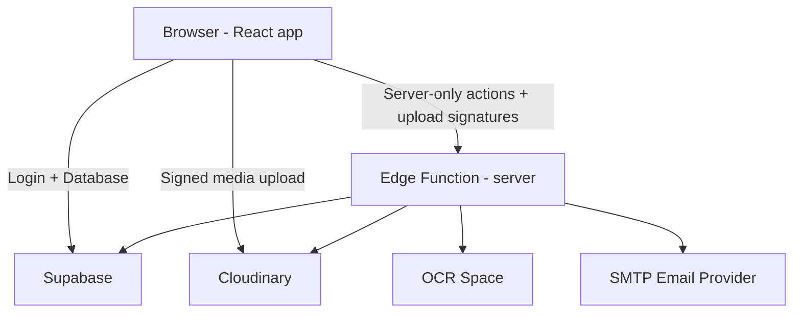

# ClinicKa

ClinicKa is a web application for managing student medical requirements at Gordon College.

If you’re new to web dev: you can think of this project as **a website (frontend)** that talks to **Supabase (backend as a service)** for login and database records, with **Cloudinary** handling uploaded media files.

## Contents

- [What ClinicKa Does](#what-clinicka-does)
- [Quick Start (Developers)](#quick-start-developers)
- [How This Project Works (Beginner-Friendly)](#how-this-project-works-beginner-friendly)
- [Where To Start In The Code](#where-to-start-in-the-code)
- [Project Map](#project-map)
- [Configuration](#configuration)
- [Useful Scripts](#useful-scripts)
- [Build And Deploy](#build-and-deploy)
- [Glossary](#glossary)
- [Advanced (Optional)](#advanced-optional)
- [Tech Stack](#tech-stack)
- [Troubleshooting](#troubleshooting)

## What ClinicKa Does

ClinicKa has four role-based portals:

- **Students** submit their profile, medical form, and lab files, then track the review status.
- **Clinic staff** review submissions, update statuses, and (optionally) use OCR to speed up encoding lab values.
- **Admins** manage users, announcements, system settings, and reports.
- **Super admins** manage administrator accounts.

### Submission Status

A submission typically moves through these statuses:

`pending` → `in_review` → `returned` / `physical_exam_done` → `approved`

If a student fixes a returned submission and re-uploads files, it becomes `resubmitted`.

## Quick Start (Developers)

### Requirements

- Node.js 20+
- npm 10+
- A Supabase project (this app is not “standalone”)

Important:

- This repo does not include the original SQL migrations. You’ll need a Supabase project that already has the ClinicKa tables/buckets/policies set up.

### Run Locally

1. Install dependencies:

```bash
npm install
```

2. Create a local env file:

```bash
cp .env.example .env.local
```

3. Fill in the minimum frontend variables in `.env.local`:

```env
VITE_SUPABASE_URL=https://your-project.supabase.co
VITE_SUPABASE_ANON_KEY=your-anon-key
```

4. Start the dev server:

```bash
npm run dev
```

Open: `http://localhost:5173`

## How This Project Works

There are **two moving parts**:

1. **Frontend (React app)**
   - This is what runs in the browser.
   - It renders pages for student/staff/admin portals.

2. **Supabase (backend)**
   - Handles sign-in (Auth), database tables (Postgres), and Edge Functions.

3. **Cloudinary (media storage)**
   - Stores uploaded announcement images, profile photos, signatures, and lab files.
   - Supabase still stores the metadata rows that point to those uploaded assets.

Sometimes the frontend needs to do a “server-only” action (for example: calling OCR.space, sending SMTP emails, or using admin privileges safely). For that, the app calls a Supabase **Edge Function** named `server`.

### Big Picture Diagram



If the terms above are unfamiliar, see the [Glossary](#glossary).

## Where To Start In The Code

If you want to understand the app quickly, start here:

- App entry + PWA logic: [src/main.tsx](src/main.tsx)
- Global providers (router, auth, react-query): [src/app/App.tsx](src/app/App.tsx)
- Route definitions (which pages exist): [src/app/routes.tsx](src/app/routes.tsx)
- Auth/session logic (roles, redirects, idle timeout): [src/app/lib/auth.tsx](src/app/lib/auth.tsx)
- All “talk to Supabase / talk to edge function” code: [src/app/lib/api.ts](src/app/lib/api.ts)

Backend (edge function):

- Main router: [supabase/functions/server/index.ts](supabase/functions/server/index.ts)
- Shared server config (CORS, Supabase client): [supabase/functions/server/context.ts](supabase/functions/server/context.ts)
- Requester auth/role checks: [supabase/functions/server/requester.ts](supabase/functions/server/requester.ts)

## Project Map

If you’re trying to find “where things live”, this is the quick mental map:

- `src/` → the frontend React app
- `src/app/pages/` → pages grouped by portal (student/staff/admin)
- `src/app/lib/` → auth + API calls (how the frontend talks to Supabase)
- `supabase/functions/server/` → the `server` edge function (backend logic)
- `scripts/` → developer scripts (ex: OCR parser verification)
- `public/` → static assets
- `vercel.json`, `Dockerfile`, `nginx.conf` → deployment helpers

## Common User Flows (In Words)

### Login → Go To The Right Portal

1. User signs in with Supabase Auth.
2. The app asks the edge function “who is this user?”
3. The app redirects them to the correct portal (student/staff/admin).

### Student Submission

1. Student fills in their profile and medical form.
2. Student uploads lab files.
3. A submission record is created and becomes visible to staff for review.

### Staff Review + Status Updates

1. Staff opens the submission queue.
2. Staff reviews details and uploaded files.
3. Staff updates the status (`in_review`, `returned`, `approved`, etc).
4. If email is enabled, staff can trigger a status email notification.

### OCR (Optional)

OCR is used to extract text/values from lab files (x-ray, CBC, urinalysis). It’s optional and mainly speeds up encoding.

## Configuration

This repo uses `.env.local` for local dev and Supabase secrets for deployed edge functions.

See [.env.example](.env.example) for the full list.

### Minimal Variables (Frontend)

- `VITE_SUPABASE_URL`
- `VITE_SUPABASE_ANON_KEY` (or `VITE_SUPABASE_PUBLISHABLE_KEY`)

### Edge Function Variables (Backend)

These are required when deploying the `server` edge function:

- `SUPABASE_URL`
- `SUPABASE_SERVICE_ROLE_KEY`
- `SITE_URL` and/or `ALLOWED_ORIGINS` (CORS allowlist)

Important safety rule:

- **Never expose `SUPABASE_SERVICE_ROLE_KEY` in the browser.** It must only live in Supabase function secrets.

### Email (Optional)

Status email notifications use SMTP:

- `SMTP_HOST`, `SMTP_PORT`, `SMTP_USER`, `SMTP_PASS`
- `SMTP_FROM_EMAIL`, `SMTP_FROM_NAME`

Tip: on Supabase Edge Functions, SMTP port `465` is commonly the one that works. Ports `25` and `587` are often blocked.

### OCR.space (Optional)

- `OCR_SPACE_API_KEY` (or `OCRSPACE_API_KEY`)

### Cloudinary (Media Uploads)

- `CLOUDINARY_CLOUD_NAME`
- `CLOUDINARY_API_KEY`
- `CLOUDINARY_API_SECRET`
- `CLOUDINARY_BASE_FOLDER` (optional, defaults to `clinicka`)
- `VITE_CLOUDINARY_CLOUD_NAME`

Cloudinary stores uploaded media and handles media delivery/optimization. Supabase remains the backend for auth, database records, Edge Functions, and file metadata. Do not expose `CLOUDINARY_API_SECRET` through any `VITE_` variable.

## Useful Scripts

- `npm run dev` - Start local dev server
- `npm run typecheck` - TypeScript type checking
- `npm run verify:ocr` - Verify OCR parsing rules
- `npm run build` - Build production assets into `dist/`
- `npm run check` - `typecheck` + `verify:ocr` + `build`

## Build And Deploy

### Deploy The Frontend

This is a normal single-page app (SPA). Build it and deploy `dist/` to any static host.

```bash
npm run build
```

This repo includes:

- [vercel.json](vercel.json) for Vercel SPA rewrites and headers
- A Docker + Nginx setup via [Dockerfile](Dockerfile) and [nginx.conf](nginx.conf)

### Deploy The Edge Function

The backend logic lives in the Supabase edge function named `server`.

```bash
supabase functions deploy server
```

Make sure CORS is configured correctly via `SITE_URL` / `ALLOWED_ORIGINS`.

## Glossary

- **Supabase**: a hosted backend (login, database, file storage, serverless functions).
- **Auth**: user login (email/password or Google).
- **Storage**: where uploaded files live (like lab results and signatures).
- **Edge Function**: a small API/serverless function you deploy to Supabase.
- **CORS**: a browser security rule that controls which websites can call your API.
- **RLS (Row Level Security)**: database rules that decide what rows a user can read/write.

## Advanced (Optional)

If you want deeper internals, open the sections below.

<details>
<summary><strong>Architecture & runtime notes</strong></summary>

### Frontend internals

- Routes: [src/app/routes.tsx](src/app/routes.tsx)
- Lazy route modules: [src/app/route-modules.ts](src/app/route-modules.ts)
- Prefetching after login (best-effort): [src/app/lib/login-prefetch.ts](src/app/lib/login-prefetch.ts)
- Session storage key: `gc_supabase_session` in [src/app/lib/api.ts](src/app/lib/api.ts)

### Edge function internals

- Router entrypoint: [supabase/functions/server/index.ts](supabase/functions/server/index.ts)
- CORS allowlist logic: `resolveCorsOrigin()` in [supabase/functions/server/context.ts](supabase/functions/server/context.ts)

</details>

<details>
<summary><strong>OCR parsing verification</strong></summary>

OCR parsing heuristics live in [supabase/functions/server/ocr-space-ocr.ts](supabase/functions/server/ocr-space-ocr.ts).

They are verified by a Node script: [scripts/verify-ocr-parsers.cjs](scripts/verify-ocr-parsers.cjs)

Run:

```bash
npm run verify:ocr
```

</details>

<details>
<summary><strong>Supabase buckets & schema expectations</strong></summary>

This repository does **not** include the original database migrations.

If you are creating a new Supabase project, you must provision:

- Tables + RLS policies expected by the frontend and edge function
- Storage buckets used by uploads

Common buckets:

- `profile`
- `student_signature`
- `lab_chest_xray`
- `lab_cbc`
- `lab_urinalysis`

Note: there are legacy references to `medical-files` for compatibility.

</details>

## Tech Stack

- React 18 + TypeScript
- React Router 7
- Vite 6 + Tailwind CSS 4
- TanStack Query
- Supabase Auth + Postgres + Storage + Edge Functions
- PWA support via `vite-plugin-pwa` + Workbox

## Troubleshooting

- `Missing Supabase config...`: check `VITE_SUPABASE_URL` and `VITE_SUPABASE_ANON_KEY`.
- Upload errors: verify the expected Supabase buckets and storage policies exist.
- Google sign-in blocked: accounts are restricted to `@gordoncollege.edu.ph`.
- Email notifications not sending: verify SMTP secrets are set for the deployed edge function.

## Attributions

- UI components in this project include `shadcn/ui`-derived source used under the MIT license.
- Project imagery includes an Unsplash photo used under the Unsplash license.

## Copyright Notice

Copyright (c) 2026 ClinicKa contributors.

All rights reserved unless a separate written license or institutional approval states otherwise.

## Disclaimer

ClinicKa is provided for clinic workflow, medical record intake, and administrative support purposes only.

- It is not a substitute for professional medical judgment, diagnosis, treatment, or emergency services.
- The software is provided "as is", without warranties of any kind, express or implied, including merchantability, fitness for a particular purpose, and non-infringement.
- Users and deploying institutions are responsible for validating data accuracy, configuring access controls correctly, and complying with applicable privacy, health-record, and school data regulations.
- The maintainers and contributors are not liable for any direct, indirect, incidental, special, or consequential damages arising from use, misuse, deployment, or inability to use the system.

## License

Unless your organization has an explicit written agreement covering this repository, this project is distributed as source-available reference material and is not automatically granted an open-source license for unrestricted redistribution, sublicensing, or commercial reuse.

If you want this repository released under a specific open-source license, add a dedicated `LICENSE` file and update this section to match it.

## Third-Party Licenses

- Parts of the UI include `shadcn/ui`-derived source, which is distributed under the MIT License.
- Project imagery may include assets governed by the Unsplash License.
- Other third-party packages, libraries, fonts, icons, and tools used by this project remain subject to their respective licenses and terms from their original authors.
