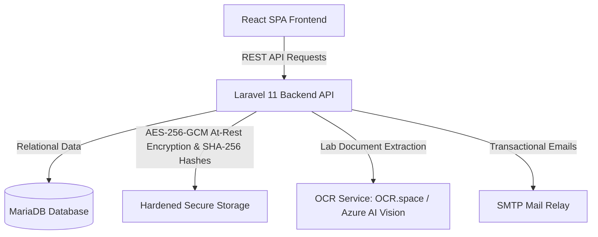

# ClinicKa

ClinicKa is a comprehensive, role-based clinic management and student health record clearance system for Gordon College. It allows students to complete their medical profile, submit annual medical clearance requirements (X-ray, CBC, urinalysis), and track clearance status, while providing clinic nurses, doctors, and administrators with tools for verification, physical examinations, reports, and system configuration.

---

## System Architecture



### Core Technologies
- **Frontend**: React 18, TypeScript, Vite, Tailwind CSS, React Router, TanStack Query, Lucide Icons.
- **Backend**: Laravel 11 (PHP 8.2+), Eloquent ORM, Laravel Sanctum authentication.
- **Database**: MariaDB (10.11+ LTS) / MySQL (8.0+).
- **Security & Cryptography**: AES-256-GCM at-rest file encryption, SHA-256 cryptographic anti-tamper upload hashing, and short-lived HMAC-signed streaming tickets.
- **OCR Engine**: Multi-provider lab-result text extraction (OCR.space and Azure AI Vision).

---

## Directory Structure

```text
ClinicKa/
├── src/                        # Frontend React SPA Application
│   ├── app/
│   │   ├── components/         # Reusable UI primitives and form components
│   │   ├── lib/                # API client, auth context, and cryptographic utilities
│   │   ├── pages/              # Portal pages grouped by role (student, staff, admin, super-admin)
│   │   └── routes.tsx          # Application route definitions and role guards
│   └── styles/                 # Global styling and Tailwind tokens
├── backend/                    # Laravel 11 REST API Backend
│   ├── app/
│   │   ├── Http/Controllers/   # API controllers (Submissions, Storage, Auth, Profiles)
│   │   ├── Http/Middleware/    # Security, RBAC role gates, payload encryption
│   │   ├── Models/             # Eloquent database models
│   │   └── Services/           # StorageService (AES encryption & SHA-256), CryptoService, OCR
│   ├── config/                 # Laravel application configurations
│   ├── database/migrations/    # Database schema migrations
│   └── routes/api.php          # API endpoints
├── database/                   # Database bootstrap scripts
│   └── mariadb_schema.sql      # Core MariaDB schema structure
├── docs/                       # Project documentation and sample assets
│   └── sample-assets/          # Reference sample documents
└── public/                     # Static frontend assets (icons, manifest, logos)
```

---

## Quick Start Guide

### Prerequisites
- **Node.js**: 20.x or newer & `npm`
- **PHP**: 8.2 or newer with extensions: `pdo_mysql`, `openssl`, `mbstring`, `fileinfo`, `curl`
- **Composer**: 2.x
- **MariaDB / MySQL**: MariaDB 10.11+ LTS or MySQL 8.0+

---

### 1. Database Setup

1. Create a database in MariaDB:
   ```sql
   CREATE DATABASE clinicka CHARACTER SET utf8mb4 COLLATE utf8mb4_unicode_ci;
   ```
2. Import the base database schema:
   ```bash
   mysql -u root -p clinicka < database/mariadb_schema.sql
   ```

---

### 2. Backend Setup (Laravel)

1. Navigate to the backend directory and install dependencies:
   ```bash
   cd backend
   composer install
   ```
2. Configure the backend environment file:
   ```bash
   cp .env.example .env
   ```
3. Update the database credentials in `backend/.env`:
   ```env
   DB_CONNECTION=mariadb
   DB_HOST=127.0.0.1
   DB_PORT=3306
   DB_DATABASE=clinicka
   DB_USERNAME=your_database_username
   DB_PASSWORD=your_database_password
   ```
4. Generate the Laravel application key and run migrations:
   ```bash
   php artisan key:generate
   php artisan migrate
   ```
5. Start the backend API server:
   ```bash
   php artisan serve
   ```
   The backend API will be available at `http://localhost:8000`.

---

### 3. Frontend Setup (React / Vite)

1. From the project root, install frontend dependencies:
   ```bash
   npm install
   ```
2. Configure the frontend environment file:
   ```bash
   cp .env.example .env.local
   ```
3. Set the API URL in `.env.local`:
   ```env
   VITE_API_URL=http://localhost:8000/api
   VITE_SITE_URL=http://localhost:5173
   ```
4. Start the development server:
   ```bash
   npm run dev
   ```
   Open `http://localhost:5173` in your browser.

---

## User Roles & Access Control

| Role | Portal Route | Description |
| :--- | :--- | :--- |
| **Student** | `/student` | Profile management, annual medical clearance submission, lab uploads, clearance tracking. |
| **Clinic Staff / Nurse** | `/staff` | Record verification, queue management, physical exam encoding, clearance approval. |
| **Clinic Admin** | `/admin` | User management, announcements, reporting analytics, system settings. |
| **Super Administrator** | `/super-admin` | Administrative account provisioning and system oversight. |

---

## Security & Data Privacy Features

- **At-Rest AES-256-GCM Encryption**: All sensitive medical documents (chest X-rays, CBC lab slips, urinalysis reports, student signatures) are encrypted before being written to disk.
- **SHA-256 Tamper Verification**: Every uploaded asset is fingerprinted with an immutable SHA-256 checksum. On retrieval, files are verified to ensure they have not been altered or corrupted.
- **Short-Lived Streaming Tickets**: Files are served via HMAC-signed, expiring tickets (60s validity) to prevent permanent URLs or authentication token leakage in browser history.
- **Role-Based File Isolation**: Strict ownership checks verify that students can only access their own medical records, while authorized medical personnel have workflow access.
- **EXIF Sanitization**: Camera metadata, GPS coordinates, and device timestamps are stripped from uploaded images prior to storage.
- **Audit Trail**: Read and write access to student medical records is logged to an immutable audit table.

---

## Environment Configuration

Refer to [`.env.example`](.env.example) for the full list of configuration options.

### Essential Variables

| Variable | Description |
| :--- | :--- |
| `VITE_API_URL` | Base URL for the backend API (`http://localhost:8000/api`). |
| `DB_CONNECTION` | Database driver (`mariadb` or `mysql`). |
| `DB_DATABASE` | Database name (`clinicka`). |
| `APP_KEY` | 32-character Laravel encryption key (`php artisan key:generate`). |
| `SMTP_HOST` | Hostname of your SMTP email provider. |
| `SMTP_PORT` | Port for SMTP mail delivery (e.g., `587` or `465`). |
| `OCR_PROVIDER` | Active OCR engine (`ocr-space` or `azure`). |
| `OCR_SPACE_API_KEY` | API key for OCR.space document parsing. |

---

## Disclaimer

ClinicKa is designed to assist clinical record-keeping, health requirement intake, and institutional clearance workflows. It is not a substitute for professional medical judgment, diagnosis, or clinical emergency response.
