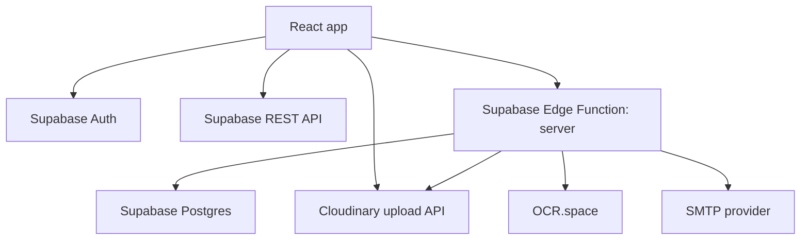

# ClinicKa

ClinicKa is a role-based clinic management portal for Gordon College. It lets students submit annual medical requirements, lets clinic staff review and clear those records, and gives administrators tools for accounts, reports, announcements, and system settings.

This repository contains the React frontend and the Supabase Edge Function backend used by the app.

## Developer Quick Start

### Requirements

- Node.js 20 or newer
- npm 10 or newer
- Access to a configured Supabase project
- Optional: Supabase CLI, if you need to serve or deploy the Edge Function locally

### Install

```bash
npm install
```

### Configure Environment

Create a local environment file:

```powershell
Copy-Item .env.example .env.local
```

At minimum, set these frontend variables:

```env
VITE_SUPABASE_URL=https://your-project.supabase.co
VITE_SUPABASE_ANON_KEY=your-anon-key
VITE_SITE_URL=http://localhost:5173
```

`VITE_SUPABASE_PUBLISHABLE_KEY` can be used instead of `VITE_SUPABASE_ANON_KEY`.

### Run The Frontend

```bash
npm run dev
```

Open `http://localhost:5173`.

Some staff/admin flows call the Supabase Edge Function at `/functions/v1/server/...`. Use a deployed function or run it locally through the Supabase CLI with matching secrets.

## Scripts

- `npm run dev` - starts the Vite development server.
- `npm run typecheck` - runs TypeScript checks without emitting files.
- `npm run verify:ocr` - validates OCR parser behavior.
- `npm run build` - creates the production build in `dist/`.
- `npm run check` - runs typecheck, OCR verification, and production build.

## Tech Stack

- React 18 and TypeScript
- Vite 6
- Tailwind CSS 4
- React Router 7
- TanStack Query
- Recharts for dashboard charts
- Radix UI primitives and local UI components
- Supabase Auth, Postgres, REST API, and Edge Functions
- Cloudinary for uploaded media
- OCR.space integration for lab-result extraction
- PWA support through `vite-plugin-pwa` and Workbox

## Application Roles

| Role | Main Area | Responsibilities |
| --- | --- | --- |
| Student | `/student` | Complete profile, submit medical forms, upload lab files, track status, view clearance/certificate pages. |
| Staff | `/staff` | Review submissions, manage queues, update statuses, issue clearances, view reports, manage announcements/settings. |
| Admin | `/admin` | Manage users, reports, announcements, and system settings. |
| Super Admin | `/super-admin` | Manage administrator accounts. |

Authentication and role routing are handled in [src/app/lib/auth.tsx](src/app/lib/auth.tsx). Routes are declared in [src/app/routes.tsx](src/app/routes.tsx).

## Architecture



### Frontend Flow

1. [src/main.tsx](src/main.tsx) configures PDF.js, PWA behavior, and mounts the app.
2. [src/app/App.tsx](src/app/App.tsx) wires TanStack Query, authentication, routing, and toast notifications.
3. [src/app/routes.tsx](src/app/routes.tsx) defines role-protected routes and lazy-loaded portal modules.
4. [src/app/lib/api.ts](src/app/lib/api.ts) is the main browser API layer. It calls the Edge Function when server privileges are needed and uses Supabase REST for direct reads or fallbacks.
5. Feature pages live under [src/app/pages](src/app/pages), grouped by role.
6. Reusable UI and feature components live under [src/app/components](src/app/components).

### Backend Flow

The main Edge Function is in [supabase/functions/server](supabase/functions/server).

Important backend files:

- [supabase/functions/server/index.ts](supabase/functions/server/index.ts) - Hono app, route registration, upload and review handlers.
- [supabase/functions/server/context.ts](supabase/functions/server/context.ts) - Supabase service client and CORS settings.
- [supabase/functions/server/requester.ts](supabase/functions/server/requester.ts) - authentication, role checks, requester profile resolution.
- [supabase/functions/server/submissions.ts](supabase/functions/server/submissions.ts) - staff dashboards, queues, submission summaries, reports.
- [supabase/functions/server/cloudinary.ts](supabase/functions/server/cloudinary.ts) - upload ticket generation and Cloudinary verification.
- [supabase/functions/server/ocr-space-ocr.ts](supabase/functions/server/ocr-space-ocr.ts) - OCR.space parsing and extraction helpers.
- [supabase/functions/server/notifications.ts](supabase/functions/server/notifications.ts) - SMTP notification helpers.

The function is mounted at:

```text
/functions/v1/server
```

Frontend calls usually look like:

```ts
apiRequest('/functions/v1/server/staff/dashboard-overview')
```

## Project Structure

```text
src/
  app/
    components/        Reusable components and feature widgets
    lib/               API, auth, settings, upload, and shared domain helpers
    pages/             Student, staff, admin, and super-admin pages
    routes.tsx         Route tree and role gates
    App.tsx            App providers
  styles/              Tailwind and global styles
supabase/
  functions/server/    Edge Function backend
  migrations/          Database migrations included with this repo
scripts/               Developer scripts
public/                Static assets
dist/                  Generated production build output
```

Start with these files when onboarding:

- [src/app/routes.tsx](src/app/routes.tsx)
- [src/app/lib/auth.tsx](src/app/lib/auth.tsx)
- [src/app/lib/api.ts](src/app/lib/api.ts)
- [src/app/lib/record-types.ts](src/app/lib/record-types.ts)
- [supabase/functions/server/index.ts](supabase/functions/server/index.ts)
- [supabase/functions/server/submissions.ts](supabase/functions/server/submissions.ts)

## Important Data Concepts

### User And Student Records

- `profiles` stores account identity, role, email, and linked `student_id`.
- `students` stores student profile details such as name, department, course, year level, sex, and contact details.
- `staff_users` stores staff profile details and position metadata.
- `archived_accounts` marks accounts that should stay inactive while preserving their records.

### Submission Records

`submissions` stores medical clearance submissions. Common statuses are:

- `pending` - submitted and waiting for staff action.
- `in_review` - staff started reviewing the record.
- `returned` - staff returned the record for correction.
- `resubmitted` - student submitted again after a return.
- `physical_exam_done` - physical exam was completed.
- `approved` - record is cleared.

The normal lifecycle is:

```text
pending -> in_review -> returned -> resubmitted -> in_review -> physical_exam_done -> approved
```

Some paths can skip or repeat states depending on staff action.

### Dashboard Status Buckets

The staff dashboard uses display buckets that are not always one-to-one with database statuses:

- `Approved Clearance` - approved records.
- `Pending` - records that still need clinic action, including pending/in-review/resubmitted flows where used by the dashboard.
- `Returned` - returned records, shown separately in red where the UI needs a returned status.
- `No Action Taken` - registered student accounts that are idle. In Submission Analytics, this also includes students with an existing returned document status because they have not completed a cleared resubmission yet.

The dashboard cards live in [src/app/components/submission-dashboard-cards.tsx](src/app/components/submission-dashboard-cards.tsx). The data is fetched through `getSubmissionReportSummaries()` in [src/app/lib/api.ts](src/app/lib/api.ts), which combines submission rows with registered student account summaries.

## UI Guidelines

ClinicKa uses a light theme with soft green accents. Preserve the existing design tokens and visual language:

- Prefer local UI components in [src/app/components/ui](src/app/components/ui).
- Use Tailwind utility classes already present in the codebase.
- Keep staff/admin pages dense, clear, and workflow-focused.
- Use Recharts for dashboard visualizations.
- Do not introduce dark-theme dashboard colors unless the whole design system changes.

## Environment Variables

See [.env.example](.env.example) for the complete template.

### Frontend

Used by Vite and available in browser code:

- `VITE_SUPABASE_PROJECT_ID`
- `VITE_SUPABASE_URL`
- `VITE_SUPABASE_PUBLISHABLE_KEY`
- `VITE_SUPABASE_ANON_KEY`
- `VITE_SITE_URL`
- `VITE_CLOUDINARY_CLOUD_NAME`

### Edge Function

Server-side only:

- `SUPABASE_URL`
- `SUPABASE_PUBLISHABLE_KEY`
- `SUPABASE_ANON_KEY`
- `SUPABASE_SERVICE_ROLE_KEY`
- `SITE_URL`
- `ALLOWED_ORIGINS`
- `ALLOW_VERCEL_PREVIEW_ORIGINS`
- `SIGNED_STORAGE_URL_EXPIRES_SECONDS`
- `ENABLE_REQUEST_LOGGING`

### Cloudinary

Server-side upload signing and optional frontend delivery helpers:

- `CLOUDINARY_CLOUD_NAME`
- `CLOUDINARY_API_KEY`
- `CLOUDINARY_API_SECRET`
- `CLOUDINARY_BASE_FOLDER`
- `VITE_CLOUDINARY_CLOUD_NAME`

### Email

Used by status notification emails:

- `SMTP_HOST`
- `SMTP_PORT`
- `SMTP_USER`
- `SMTP_PASS`
- `SMTP_FROM_EMAIL`
- `SMTP_FROM_NAME`

### OCR

Used by lab-result extraction:

- `OCR_SPACE_API_KEY` or `OCRSPACE_API_KEY`
- `OCR_SPACE_API_URL`
- `OCR_SPACE_LANGUAGE`
- `OCR_SPACE_MAX_BYTES`
- `LAB_UPLOAD_MAX_BYTES`

Never expose `SUPABASE_SERVICE_ROLE_KEY`, `CLOUDINARY_API_SECRET`, or SMTP credentials to frontend code.

## Common Development Tasks

### Add A New Page

1. Create the page under the correct role folder in [src/app/pages](src/app/pages).
2. Add a lazy loader in [src/app/route-modules.ts](src/app/route-modules.ts).
3. Add the route in [src/app/routes.tsx](src/app/routes.tsx).
4. Add navigation in the matching layout if needed.

### Add Or Change API Behavior

1. Prefer adding browser-facing functions to [src/app/lib/api.ts](src/app/lib/api.ts).
2. If the action needs service-role access, add or update an Edge Function route in [supabase/functions/server/index.ts](supabase/functions/server/index.ts).
3. Keep shared return shapes in [src/app/lib/record-types.ts](src/app/lib/record-types.ts).
4. Run `npm run typecheck`.

### Change Staff Dashboard Analytics

1. Update data fetching in `getSubmissionReportSummaries()` in [src/app/lib/api.ts](src/app/lib/api.ts).
2. Update chart and bucket logic in [src/app/components/submission-dashboard-cards.tsx](src/app/components/submission-dashboard-cards.tsx).
3. Keep the dashboard display order: Approved Clearance, Pending, Returned, No Action Taken.
4. Run `npm run typecheck` and check the staff dashboard visually.

### Update OCR Parsing

1. Edit [supabase/functions/server/ocr-space-ocr.ts](supabase/functions/server/ocr-space-ocr.ts).
2. Add or update parser examples in [scripts/verify-ocr-parsers.cjs](scripts/verify-ocr-parsers.cjs).
3. Run `npm run verify:ocr`.

## Build And Deployment

### Frontend

```bash
npm run build
```

Deployment helpers included in the repo:

- [vercel.json](vercel.json) - SPA rewrites and headers for Vercel.
- [Dockerfile](Dockerfile) - containerized frontend build.
- [nginx.conf](nginx.conf) - Nginx SPA hosting config.

### Supabase Edge Function

Deploy the backend function:

```bash
supabase functions deploy server
```

Make sure Supabase secrets are configured before deploying:

```bash
supabase secrets set SUPABASE_SERVICE_ROLE_KEY=...
supabase secrets set CLOUDINARY_API_SECRET=...
```

Set the rest of the required secrets from [.env.example](.env.example) according to the environment.

## Database And Storage Notes

This repo includes migrations in [supabase/migrations](supabase/migrations), but treat them as project migrations, not a guaranteed one-command bootstrap for a blank Supabase project.

Before running against a new Supabase project, verify:

- required tables exist
- RLS policies allow the expected role access
- Edge Function secrets are present
- Cloudinary credentials are valid
- storage or metadata tables match the upload flow
- required admin/system settings have valid defaults

Common media buckets or categories used by the app include:

- `profile`
- `student_signature`
- `lab_chest_xray`
- `lab_cbc`
- `lab_urinalysis`
- legacy `medical-files` references for compatibility

## Troubleshooting

### Missing Supabase config

Check `VITE_SUPABASE_URL` and `VITE_SUPABASE_ANON_KEY` or `VITE_SUPABASE_PUBLISHABLE_KEY`.

### Staff/admin actions fail but the frontend loads

The Edge Function may be missing, undeployed, or missing secrets. Check `/functions/v1/server/...` calls in the browser network tab.

### Uploads fail

Check Cloudinary secrets, upload size limits, allowed MIME types, and the upload completion route.

### OCR fails

Check OCR.space secrets, file size/page limits, and run:

```bash
npm run verify:ocr
```

### Google sign-in is rejected

Student accounts are restricted to the Gordon College email domain.

### PWA shows stale UI

The app registers a service worker in [src/main.tsx](src/main.tsx). Refresh the installed app or clear site data if a stale service worker is serving old assets during development.

## Verification Checklist

Before handing off a code change:

```bash
npm run typecheck
npm run build
```

For OCR changes:

```bash
npm run verify:ocr
```

For broad changes:

```bash
npm run check
```

## License And Usage

This repository does not currently declare a standard open-source license file. Unless your organization has a separate written agreement, treat this project as source-available internal project code rather than unrestricted open-source software.

## Disclaimer

ClinicKa supports clinic workflow, student medical record intake, and administrative coordination. It is not a substitute for professional medical judgment, diagnosis, treatment, or emergency response. Deploying institutions are responsible for validating data accuracy, access controls, privacy practices, and legal compliance.
